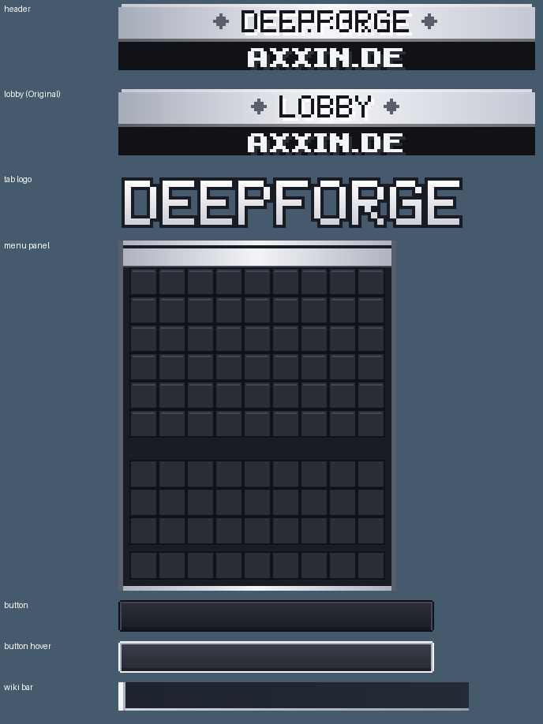
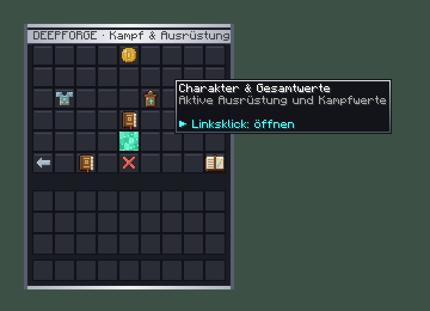
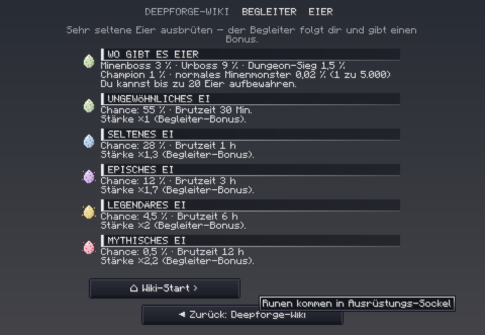

# Neu in Deepforge 0.16.0 – Design des Netzwerks Axxin.de

Beim Serverstart steht im Log `Deepforge 0.16.0 ready`.

**Neues Ressourcenpaket.** Die SHA-1 steht in `resourcepack/pack.sha1` und ist in `config.yml` schon eingetragen.

## ⚠ Einmal von Hand auf dem Server ändern
In der **laufenden** `plugins/Deepforge/config.yml` steht noch der alte Netzwerkname. Minecraft-Plugins überschreiben eine vorhandene Konfiguration nicht. Bitte ändern:
```yaml
display:
  network-name: 'Axxin.de'
```
Die `config.yml` hier im Repository ist schon angepasst. Du kannst auch einfach den `display:`-Block daraus übernehmen.

## Übernommen aus dem Netzwerk-Paket (Netzwerk-Pack_Axxin.zip)
- **Alle Netzwerk-Grafiken in der neuen Fassung:**
  - Ränge
  - Status-Abzeichen
  - Nachrichten-Symbole
  - Fortschrittsbalken
  - Kopfleisten und Trenner
- **Neu dazugekommen:**
  - Platzierungen 1–10
  - Board-Köpfe (Top Kills/Siege …)
  - Pokal- und Karten-Symbol
  - Status „Warten / Vorbereitung / Pause“
- **Neue Ränge in Deepforge:** **Partner**, **Sub 2** und **Sub 3**, mit den Abzeichen aus dem Paket. Rechte: `network.rank.partner`, `network.rank.sub2`, `network.rank.sub3`, wie bei den anderen Rängen auch `varo.…` oder `deepforge.rank.…`.
- **Bossleisten** im Netzwerk-Look. Sie sind jetzt auch im Deepforge-Paket enthalten, also sieht es auch ohne Lobby-Paket gleich aus.

## Deepforge im Axxin-Stil
**Kein Orange mehr:** Alles ist jetzt dunkel, silbern und weiß wie im Netzwerk. Die Farben sind aus dem Paket ausgelesen: #111118 / #1A1C24 / #2A2C36 dunkel, #ADB2BF → #F4F5F8 silber.

| Teil | vorher | jetzt |
|---|---|---|
| Scoreboard-Kopf | orange Leiste „◆ DEEPFORGE ◆“ | **silberne Leiste mit dunklen, geprägten Buchstaben**, darunter schwarzes Band „AXXIN.DE“, genau wie „◆ LOBBY ◆“ |
| Tab-Logo | orange Buchstaben | **weiße Pixelbuchstaben mit dunklem Rand** wie das AXXIN-Logo |
| Netzwerkname (Tab, Scoreboard) | „Pinguin Netzwerk“ im Gold-Verlauf | **„Axxin.de“ im Silber-Verlauf** |
| Menü-Hintergrund | Gold-Braun-Rahmen | **dunkler Schiefer, Silberrahmen, silberne Titelleiste** |
| Menü-Knöpfe (Namen) | gold | weiß (nicht anklickbare grau) |
| Chat-Nachrichten | „Deepforge »“ in Gold | „**Deepforge** ▸“ weiß-fett mit grauem Trenner, wie im Netzwerk |
| Wiki-Fenster | orange Kanten und Überschriften | silberne Kanten, weiße Pixel-Überschriften, hellgrauer Text |
| Knöpfe / Tooltips / Scrollleiste | Glutkante | dunkel mit **silberner Kante**, beim Überfahren weiß umrandet |
| HUD-Leiste | goldene Oberkante | silberne Oberkante |

Vorschau aus den echten Paket-Texturen:





Gold bleibt nur dort, wo es etwas bedeutet: Geld im HUD, Beute-Raritäten, Prestige-Sterne.

## Zu den fehlenden Zeichen („harakter“)
Ich habe auch das Netzwerk-Paket darauf geprüft. Seine Schrift-Datei fügt nur Symbole hinzu (Private-Use-Zeichen), sie überschreibt keine Buchstaben. Es ist also nicht die Ursache. Falls das „C“ weiter fehlt, bitte einen zweiten Screenshot und die Liste der aktiven Ressourcenpakete schicken.

## Getestet
- **316 Unit-Tests** grün.
- **Paket geprüft:** 478 Texturen, ZIP intakt, alle Schrift-Zeichen passen in den Font-Atlas.
- **Live:** Server startet mit 0.16.0. Alle 35 Menüs wurden vom Test-Bot geöffnet, das Wiki mit Paket geladen, keine Fehler im Server-Log.
