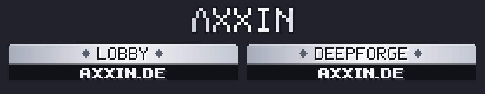

# Neu in Deepforge 0.16.1 – Gildenfarbe, Axxin-Paket 1:1, Drohnen-Fehler behoben

Beim Serverstart steht im Log `Deepforge 0.16.1 ready`.

**Neues Ressourcenpaket.** Die SHA-1 steht in `resourcepack/pack.sha1` und ist in `config.yml` schon eingetragen.

## 🎨 Gildenfarbe (Clan-Farbe)
Das Kürzel `[TAG]` hat jetzt die Farbe der Gilde:
- im Chat
- in der Tab-Liste
- über dem Kopf
- im Gildenchat

Bisher war es immer türkis.

- **Im Menü:** Gilde → links oben der **Farbstoff-Knopf „Gildenfarbe“** → Farbe anklicken.
  - Jede Farbe zeigt eine Vorschau mit dem echten Kürzel.
  - Die aktuelle Farbe leuchtet.
  - Das Banner oben färbt sich mit.
- **Per Befehl:** `/df gilde farbe <Farbe>`, z. B. `/df gilde farbe dunkelrot`. `/df gilde farbe` ohne Farbe öffnet die Auswahl.
- **14 Farben:** Türkis, Petrol, Blau, Dunkelblau, Hellgrün, Grün, Gelb, Gold, Rot, Dunkelrot, Rosa, Lila, Weiß, Grau.
- **Wer darf ändern:** nur **Anführer und Offiziere**. Alle anderen sehen die Farbe, können sie aber nicht ändern.
- Die ganze Gilde bekommt eine Nachricht: „Wanda hat die Gildenfarbe geändert: Gold.“
- Rechts oben im Gildenmenü steht neu „Mitglieder einladen“ mit dem Befehl und den freien Plätzen.
- Alte Gilden behalten Türkis, bis jemand eine Farbe wählt.

## 🖼 Ressourcenpaket = Axxin-Paket 1:1 (dein Hinweis)
Bisher hatte Deepforge die Netzwerk-Grafiken in einen eigenen Bereich kopiert und das Logo nachgezeichnet. Jetzt gilt:

- **Das komplette `Netzwerk-Pack_Axxin.zip` steckt unverändert im Deepforge-Paket.** Alle 205 Dateien sind byte-genau gleich:
  - `pack.png` und die Beschreibung „Axxin.de“
  - die Netzwerk-Schrift mit allen Rängen, Symbolen, Status, Balken, Platzierungen und Board-Köpfen
  - die Kronen
  - die Bossleisten
- **Andere Netzwerk-Plugins funktionieren damit auch auf dem Deepforge-Server.** Chat, Proxy und Tab nutzen dieselben Zeichen wie in der Lobby, und die sind jetzt da.
- **Tab-Logo:** Das originale **AXXIN**-Logo, wie in jedem Axxin-Modus. Mein nachgezeichnetes „DEEPFORGE“-Logo fällt weg.
- **Scoreboard-Kopf „◆ DEEPFORGE ◆ / AXXIN.DE“:**
  - gleiche Leiste, Buchstaben, Prägung und Rauten wie „◆ LOBBY ◆“
  - Zum Beweis erzeugt der Generator „◆ LOBBY ◆“ und „◆ VARO ◆“ **pixelgenau** wie die Originale (0 abweichende Pixel).
- **Fehler dabei gefunden und behoben:**
  - Im alten Kopf standen kleine Punkte in P, F und O. Das waren Buchstabenreste aus den Original-Köpfen.
  - Das G hatte eine andere Form als in der Axxin-Schrift.
- **Deepforge kommt nur obendrauf:** eigene Erze, Items, Menüs, HUD und Wiki, im Axxin-Silber-Stil. Nichts davon überschreibt eine Axxin-Datei. Die Paket-Prüfung schlägt Alarm, falls doch.

## 🐞 Fehler aus dem Server-Log behoben
`Task #125 … Health value (23.25) must be between 0 and 20` in `Drones.behave`:
- **Ursache:** Die Sanitäter-Drohne heilte bis zum Deepforge-Leben, z. B. 23,25. Direkt nach dem Joinen steht das Minecraft-Maximum aber noch kurz auf 20, und Paper wirft dann einen Fehler.
- **Behoben:** Leben wird jetzt überall auf das aktuelle Maximum begrenzt. Das gilt nicht nur für die Drohne, sondern für alle 12 Stellen, an denen Leben gesetzt wird:
  - Heiltränke und Begleiter
  - Dungeon-Heilung, Wiederbeleben und Checkpoint
  - Boss-Start und Regeneration

## Getestet
- **317 Unit-Tests** grün. Neu: Gildenfarbe (Rechte, deutsche Namen, „weiss“/„Türkis“, unbekannte Farbe, alte Spielstände).
- **Paket geprüft:**
  - 482 Texturen, ZIP intakt
  - jede Axxin-Datei byte-gleich im Paket
  - alle Schrift-Zeichen passen in den Font-Atlas
- **Live mit Test-Bot:**
  - Gilde gegründet, Farbmenü geöffnet, Gold angeklickt: Menü, Banner und Gildenmeldung sind gold.
  - `/df gilde farbe dunkelrot` wirkt, `pink` wird mit der Farbliste abgelehnt.
  - Paket angenommen: Tab-Kopf nutzt das AXXIN-Logo, der Scoreboard-Titel den neuen Kopf.
  - Drohnen-Fehler nachgestellt: Minecraft-Maximum per Konsole unter das Deepforge-Leben gesetzt, Drohne heilt weiter, **keine Fehler** im Log.
