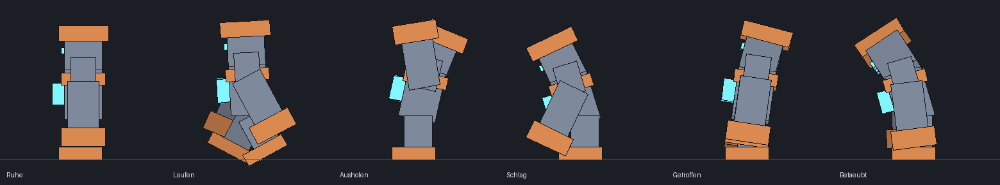

# Neu in Deepforge 0.17.0 – Netzwerk-Party, Mob-Fixes, Meldungen im Chat

Beim Serverstart steht im Log `Deepforge 0.17.0 ready`. **Das Ressourcenpaket bleibt gleich** (wie 0.16.1).

Dies ist der erste Teil der Open-Beta-Überarbeitung. Welt (Dorf, Minen, Dungeons) und Bosskämpfe folgen in den nächsten Updates.

## 🎉 Party = Netzwerk-Party (PartyxFreundeSystem)
Deepforge übernimmt jetzt die Partys aus eurem Proxy-Plugin **PartyxFreundeSystem**.

**So funktioniert es:**
- Party wie überall im Netzwerk: `/party invite <Name>`, `/party accept`, `/party leave` …
- Kommt die Party auf Deepforge (der Leader mit `/deepforge`, die anderen folgen automatisch), ist sie dort **automatisch auch die Deepforge-Party**.
- Damit teilt ihr Camp und Minen und geht zusammen in Dungeons.
- `/df party` zeigt z. B. „Party: 2 (Netzwerk) · Leiter: Wanda“.
- `/df party ready` bestätigt wie bisher. Der Leiter startet den Dungeon.
- Wer im Netzwerk die Party verlässt, ist sofort auch in Deepforge raus.
- `/df party create/invite/accept/leave` verweist auf `/party`.
- Ein Gewölbe fasst weiterhin höchstens 4 Spieler. Bei größeren Netzwerk-Partys sagt Deepforge das beim Start.
- Ohne PartyxFreundeSystem bleibt alles wie bisher (`/df party …`).

**Wie das technisch läuft:**
- Das Party-Plugin selbst schickt den Servern nicht, wer mit wem in einer Party ist. Ich habe es dekompiliert, um das zu prüfen.
- Deshalb liest jetzt das **DeepforgeProxy-Plugin (1.1.0)** auf dem Proxy jede Sekunde die Partys aus PartyxFreundeSystem und schickt sie an den Deepforge-Server.
- **Am PartyxFreundeSystem-Jar wird nichts verändert.**
- Spieler können diese Daten nicht fälschen; der Proxy blockt den Kanal für Spieler.

**Installation:** `proxy/DeepforgeProxy.jar` (neu: 1.1.0) auf dem Proxy austauschen und den Proxy neu starten. Im Proxy-Log steht dann:
```
PartyxFreundeSystem erkannt: Netzwerk-Partys gehen an deepforge.
Netzwerk-Partys aus PartyxFreundeSystem verbunden.
```

## 🤝 Party bleibt nach dem Dungeon bestehen
Bisher wurde die Party beim Ende eines Dungeons (oder beim Verlassen) aufgelöst. Jetzt bleibt sie zusammen. Nur wer den Server verlässt, fällt aus einer Deepforge-eigenen Party.

## 👹 Mob-Fixes
- **Glühender Husk hinter Champions:**
  - Champions, Glanzmonster und der Urboss setzten das Glühen auch auf die unsichtbare Hitbox (einen Husk). Minecraft zeichnet bei unsichtbaren, glühenden Mobs trotzdem den Umriss.
  - Jetzt glüht nur noch das Monster-Modell. Spieler ohne Ressourcenpaket sehen weiter den glühenden Mob.
  - Der Urboss glüht jetzt lila.
- **Köpfe, die sich lösen:**
  - Jedes Körperteil drehte sich um seinen eigenen Mittelpunkt. Zuckte ein Mob bei einem Treffer zusammen, kippte der Körper unter dem Kopf weg, und die Arme drehten sich auf der Stelle.
  - Jetzt haben die Mobs ein **echtes Skelett mit Gelenken**:
    - Kopf und Arme hängen am Körper.
    - Die Arme schwingen aus der Schulter, die Beine aus der Hüfte.
- **Neue Animationen:**
  - **Ausholen:** lehnt sich zurück, beide Arme hoch über dem Kopf.
  - **Schlag:** wirft sich nach vorn, die Arme krachen nach unten, dann federt er zurück. Kommt bei jedem Treffer gegen dich und am Ende jedes Wind-ups.
  - **Getroffen:** zuckt zurück.
  - **Betäubt:** sackt nach vorn, der Kopf hängt zur Seite.
  - **Laufen:** Arme und Beine gegengleich, leichtes Wippen.
  - **Stehen:** ruhiges Atmen.



## 💬 Ankündigungen im Chat statt auf dem Bildschirm
Beute und Fortschritt kommen jetzt als hervorgehobene Chat-Zeile im Axxin-Stil (`Deepforge ▸ ÜBERSCHRIFT · Details`):
- **Beute:** in der Farbe der Seltenheit
- Kiste geöffnet, Boss besiegt, Fundstück, Ei, Glanzfang, Glänzendes Monster, Sternenstein
- Meisterschaft, Tiefenpass-Stufe, Weltereignis, Krit-Schmiede
- „Nicht möglich“ im Menü: Der Grund steht im Chat, ein Ton signalisiert es.

**Groß auf dem Bildschirm bleibt nur, was im Kampf wichtig ist:**
- Boss-Warnungen zum Ausweichen
- Urboss erwacht
- Wächter im Dungeon und Dungeon-Ebenen
- Sieg-Bildschirm und Prestige

## Getestet
- **325 Unit-Tests** grün. Neu:
  - Netzwerk-Partys: Abgleich, Leiter, Bereit-Status, Auflösen, Nachrichtenformat
  - Skelett: Kopf und Schultern bleiben in jeder Pose am Körper, Hüftgelenk fest
  - Schlag-Ablauf
- **Live-Test mit echtem Netzwerk:** BungeeCord + LuckPerms + MySQL + PartyxFreundeSystem + DeepforgeProxy 1.1.0, Lobby und Deepforge.
  - In der Lobby `/party invite Bodo` + `/party accept`, dann `/deepforge`: Bodo folgt automatisch.
  - Deepforge zeigt „Party: 2 (Netzwerk) · Leiter: Wanda“.
  - Beide bereit, Dungeon startet mit beiden.
  - Nach dem Verlassen des Dungeons besteht die Party weiter.
  - `/party leave` im Netzwerk ist sofort in Deepforge übernommen.
  - **Dabei gefunden und behoben:** Die erste Fassung der Proxy-Brücke hätte jeden Spieler beim Einloggen gekickt (Klasse nicht öffentlich). Das war vor der Auslieferung behoben.
- **Live auf Deepforge:** abbauen und kämpfen mit den neuen Animationen, HUD stabil, keine Fehler im Log.
