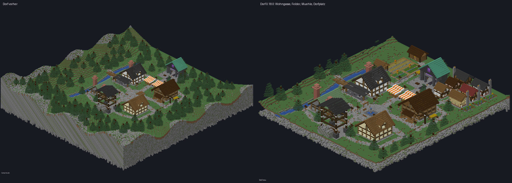
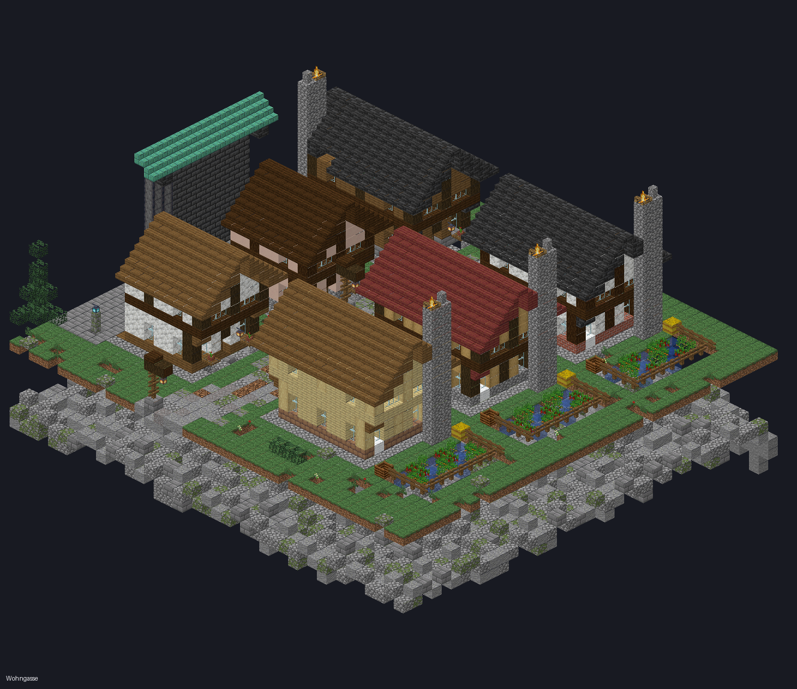
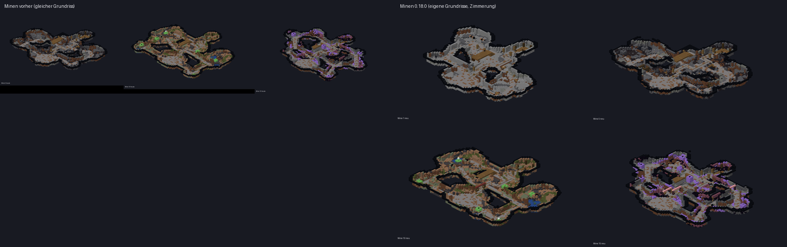
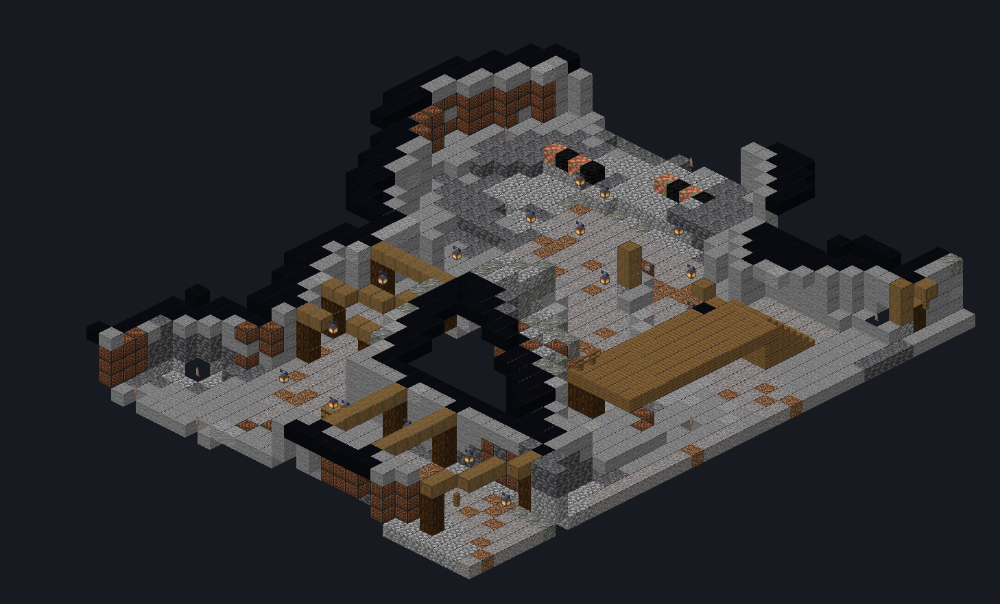
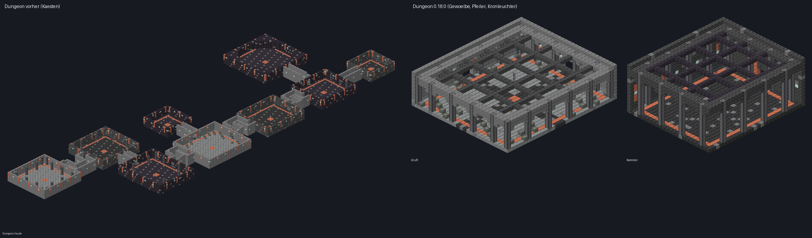

# Neu in Deepforge 0.18.0 – Dorf, Minen und Dungeons überarbeitet

Beim Serverstart steht im Log `Deepforge 0.18.0 ready`. **Das Ressourcenpaket bleibt gleich** (wie 0.16.1).

Teil 2 der Open-Beta-Überarbeitung. Als Vorlage dienten Referenzbilder aus dem Minecraft-Wiki (Mineshaft, Trial Chambers, Ancient City) und Bau-Leitfäden für mittelalterliche Dörfer.

## ⚠ Einmaliger Umbau beim ersten Start
Camp (v3) und Minen (v5) haben neue Versionsmarker. Beim ersten Start mit 0.18.0 baut der Server **jeden bestehenden Plot automatisch um**. Im Log steht dann:
```
Camp v3 ready for plot …; surface layout complete.
Mines v5 ready for plot …; 17 cave networks complete; profile preserved.
```
- **Profile, Geld, Ausrüstung, Lager, Arbeiter: alles bleibt.** Nur die Blöcke von Camp und Minen werden neu gesetzt.
- Auf dem Testserver dauerte das pro Plot etwa 20 s fürs Camp und etwa 2 min für alle 17 Minen, ohne Fehler.
- Am besten zu einer ruhigen Zeit starten.

## 🏘 Das Dorf
**Vorher:** fünf Gebäude locker auf einer Wiese. **Jetzt ein echtes Dorf:**
- **Dorfplatz:**
  - Pflaster im Muster mit Rand
  - Brunnen mit Wasserspiel in der Mitte
  - Bänke, Blumenbeete, Anschlagbrett und vier Laternen
  - Der Spawnpunkt bleibt frei.
- **Wohngasse** (südöstlich, vom Ringweg aus):
  - eine geschwungene Gasse mit **6 Fachwerkhäusern in 6 Stilen**
  - Steinsockel, auskragendes Obergeschoss, steiles Satteldach mit Überstand
  - rauchender Kamin, Fensterläden, Blumenkästen, Tür mit Stufe und Laterne
  - innen Bett, Tisch und Fass
  - die östlichen Häuser mit eingezäuntem Gemüsegarten
- **Felder am Bach** (südwestlich):
  - Weizen, Karotten und Kartoffeln mit Wasserkanälen
  - Zäune, Tore und Vogelscheuchen
  - eine Scheune mit Heuboden
- **Wassermühle** am Bach mit großem Holzrad.
- Wege mit Laternen; der Wald wurde für das neue Viertel gelichtet.
- Der alte Ziehbrunnen neben dem Platz ist weg; der Brunnen ersetzt ihn.




## ⛏ Die Minen
- **Echte Grubenzimmerung** wie in einem Mineshaft:
  - In allen Stollen steht alle 4 Blöcke ein Rahmen aus zwei Pfosten, einem Querbalken und Zaun-Streben.
  - **Jede Mine hat ihre eigene Holzart:** Fichte, Birke, Tropenholz, Mangrove, Schwarzeiche, Akazie, Karmesin, Bleiche Eiche, Wirr, Kirsche …
  - Die Rahmen stehen nie auf dem Gleis- und Laufweg.
- **Jede Mine hat ihren eigenen Grundriss:**
  - Die Seitenkammern liegen in jeder Mine an anderer Stelle und sind anders groß.
  - Dazu kommen pro Mine zwei zusätzliche Nischen.
  - Die Deckenhöhe der Hallen ist pro Mine verschieden, von gedrungen bis hoch.
  - Der Hauptstollen vom Aufzug zum Boss bleibt gleich, weil Schienen und Arbeiter ihn nutzen.




## 🏰 Die Dungeons
**Vorher:** rechteckige Kästen mit glatten Wänden und flacher Decke. **Jetzt Gewölbe:**
- **Pfeiler** alle 6 Blöcke an den Wänden, mit **Spitzbögen** dazwischen.
- **Gewölbter Deckenrand** und **Rippengewölbe** quer über die Decke.
- **Kronleuchter** an Ketten über der Raummitte und den vier Viertelpunkten; in der Frostkrypta mit Seelenlaternen.
- Spinnweben hoch in den Ecken.
- Sockelleiste aus poliertem Stein und ein **Läufer** im Boden von Tür zu Tür.
- **Gänge:**
  - abgeschrägte Deckenkanten, sodass der Gang gewölbt wirkt
  - **Rippenbögen** alle 4 Blöcke
  - Sockel an den Wänden
- **Der Grundriss bleibt gleich.** Gegner-Positionen, Fässer, Rätsel und Kampfflächen funktionieren wie bisher. Neu unterhalb Kopfhöhe sind nur die schlanken Pfeiler.



## Getestet
- **328 Unit-Tests** grün. Die bestehenden Tests sichern ab:
  - jede Kammer erreichbar
  - jedes Erz abbaubar
  - geschlossene Minenhülle
  - Galerie erreichbar
  - Gänge begehbar
  - Spawn frei
- **Neue Tests:**
  - Zimmerung in jeder Mine mit mindestens 8 Holzarten
  - Dorf mit Häusern, Betten, Feldern und Brunnen
  - Drehlogik der Häuser
- **Alle 322 Blockzustände** von Camp und Minen sind gegen die echten 1.21.8-Blockdefinitionen geprüft.
- **Live:**
  - Umbau eines bestehenden Plots ohne Fehler.
  - Bot im Dorf: Türen, Felder, Vogelscheuchen, Betten und Brunnen vorhanden, Spawn frei.
  - Bot in der Mine: 316 Zimmerungsblöcke im Umkreis.
  - Dungeon aufgebaut: Laternen an Ketten, Rippen, Sockel. Keine Exception im Log.
- Die Bilder stammen aus einem eigenen Renderer, der die Baupläne mit den echten Minecraft-Texturen zeichnet.
