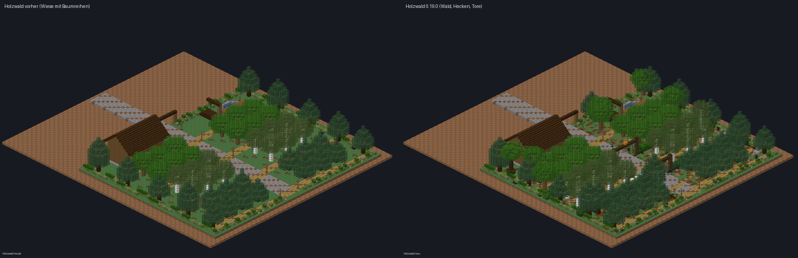

# Neu in Deepforge 0.19.0 – Der Holzwald wird ein Wald

Beim Serverstart steht im Log `Deepforge 0.19.0 ready`. **Das Ressourcenpaket bleibt gleich** (wie 0.16.1).

Der Wald hat einen neuen Versionsmarker und wird bei jedem Plot **einmal automatisch neu gebaut**. Erntebäume, Holz, Stufen und Arbeiter bleiben.

## 🌲 Wald statt Wiese (dein Hinweis)
- **Waldboden** statt Rasen: Gras, Podsol, Grobes Erdreich, Moos und Wurzelerde gemischt. Im Fichtenhain gibt es mehr Nadelboden.
- **Viel mehr Bäume:** Zwischen den Erntebäumen stehen jetzt Zierbäume:
  - im Eichenhain Eichen und Schwarzeichen
  - im Birkenhain Birken
  - im Fichtenhain hohe Fichten
  - Die Kronen bilden ein Blätterdach.
- **Unterholz:** Gras, Farne, Büsche, Glühwürmchenbüsche, Maiglöckchen und Kornblumen, Pilze, Süßbeeren im Fichtenhain, Laubstreu auf dem Boden.
- **Waldleben:** umgestürzte Stämme mit Moos und Pilzen, bemooste Felsbrocken, Baumstümpfe.
- **Wege:** In jedem Hain verläuft ein schmaler Pfad durch die Mitte.
- Die Erntebäume stehen wie bisher; Arbeiter und Nachwachsen sind unverändert.

## 🚧 Haine nach Stufe gesperrt
- Zwischen Eichen-, Birken- und Fichtenhain wächst ein **dichtes Dickicht** (2–3 Blöcke hoch). Durch kommt man nur über den **Torbogen am Hauptweg**.
- **Ohne die Forststufe:**
  - Das Tor ist **für dich geschlossen** (Zauntor), andere sehen ihren eigenen Stand.
  - Wer trotzdem hineinkommt, z. B. über die Hecke oder per Enderperle, **wird vor das Tor zurückgesetzt**.
  - Die Meldung sagt, was fehlt, z. B.: „Birkenhain gesperrt: erst ab Forststufe 2. Freischalten am Sägewerk (Axt 2 · 64 Holz · 1.000 $).“
- Über jedem Tor steht, ob der Hain offen ist.
- Nach dem Freischalten geht das Tor sofort auf.

## 👾 Waldmonster
Wie in den Minen kommen jetzt im Wald Monster aus den Bäumen:
- **Moosling, Borkenwächter, Dornenwerfer**
  - im Moos-Look
  - mit den neuen Schlag-Animationen
  - mit Champions und Glanzmonstern
- **Stärke nach Hain:** Eichenhain wie Mine 1, Birkenhain wie Mine 3, Fichtenhain wie Mine 5.
- Erscheinen nur in Hainen, die du betreten darfst, und nicht am Sägewerk.
- Verlässt du den Wald, endet der Kampf, wie beim Verlassen einer Mine.
- **Beute:**
  - Geld, Monsterteile, Runen und Gegenstände wie Minenmonster
  - zusätzlich ein **Bündel Holz** der Hain-Holzart (3–7)
  - manchmal **Harz**, bei Champions jedes zweite Mal
- Waldmonster zählen nicht für die Minen-Jagdaufträge.

## Getestet
- **329 Unit-Tests** grün. Neu:
  - Die Hecke zwischen den Hainen ist überall geschlossen, nur der Torbogen ist offen.
  - Die Hain-Zuordnung stimmt.
- **Weiter abgesichert:** jeder Erntebaum und das Sägewerk zu Fuß erreichbar, Erntekronen getrennt, Laub zerfällt nicht.
- **Alle Blockzustände** des Waldes sind gegen 1.21.8 geprüft, inklusive der neuen Blöcke Laubstreu, Busch und Glühwürmchenbusch.
- **Live:**
  - Wald neu gebaut.
  - Wanda (Forststufe 0) läuft in den Birkenhain: zurückgesetzt, mit Meldung; das Tor erscheint für sie geschlossen.
  - Im Eichenhain kamen nach kurzer Zeit zwei Waldmonster.
  - Keine Fehler im Log.
