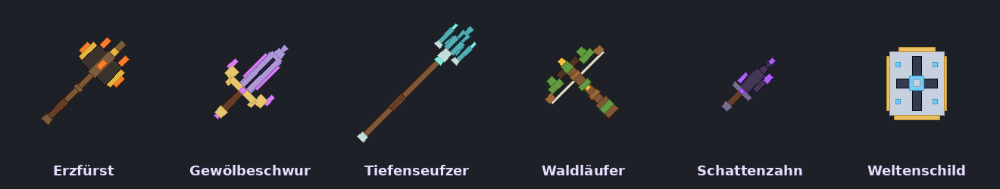

# Neu in Deepforge 0.20.0 – Die Relikt-Schmiede

Beim Serverstart steht im Log `Deepforge 0.20.0 ready`.

**Neues Ressourcenpaket** mit den Relikt-Modellen. Die SHA-1 steht in `resourcepack/pack.sha1` und ist in `config.yml` schon eingetragen.

## ⚒ Relikt-Waffen: richtig selten, nur geschmiedet (dein Wunsch)
Es gibt **6 Relikte**, die man **nirgends findet**. Man muss sie schmieden. Jedes braucht **mindestens 10 seltene Teile von 3 verschiedenen Bossarten**. Ein Relikt bedeutet also viele Bosskämpfe in mehreren Spielbereichen.

| Relikt | Typ | Effekt | Rezept |
|---|---|---|---|
| **Erzfürst** | Hammer | Haltungsschaden ×1,6 · Hammerfähigkeit +50 % | 6 Ur-Erzkern · 3 Wächterzahn · 1 Urauge |
| **Gewölbeschwur** | Schwert | Lebensraub: 4 % des Schadens heilen dich | 2 Ur-Erzkern · 4 Wächterzahn · 5 Gewölbesiegel |
| **Tiefenseufzer** | Speer | +30 % Schaden gegen Bosse und Wächter | 3 Ur-Erzkern · 3 Gewölbesiegel · 4 Tiefenperle |
| **Waldläufer** | Armbrust | 25 % Chance: jeder Schuss trifft ein zweites Mal | 3 Ur-Erzkern · 2 Wächterzahn · 5 Waldherz |
| **Schattenzahn** | Dolch | Grund-Krit-Schaden 260 % statt 200 % | 6 Wächterzahn · 2 Tiefenperle · 2 Waldherz |
| **Weltenschild** | Nebenhand | 20 % weniger Schaden aus jeder Quelle | 4 Gewölbesiegel · 4 Tiefenperle · 2 Urauge |

**Dazu kostet jedes Relikt 250.000 $ und 200 Schmiedestaub.**

- **Stärke:** Mythisch ×1,3, auf Höhe deiner **tiefsten Mine**. Ein Relikt ist damit stärker als jeder gefundene Mythisch-Gegenstand derselben Mine.
  - Wer später tiefer kommt, kann ein neues schmieden.
- **Eigene 3D-Modelle** im Ressourcenpaket:
  - Erzfürst mit Krone aus glühenden Erzspitzen
  - Gewölbeschwur als Runen-Großschwert mit Flügel-Parierstange
  - Tiefenseufzer als Dreizack
  - Waldläufer als bemooste Armbrust
  - Schattenzahn als gekrümmter Fangzahn
  - Weltenschild als echter Turmschild
- Der Effekt wirkt nur, solange das Relikt **angelegt** ist. Er gilt in **Minen, Dungeons, Tiefengang und Wald**.

## 💎 Die seltenen Teile
| Teil | Wer lässt es fallen | Chance |
|---|---|---|
| **Ur-Erzkern** | Gebietsbosse in den Minen | 4 / 6 / 8 % (Normal / Veteran / Albtraum) |
| **Wächterzahn** | Wächter in den Dungeons | 6 / 8 / 10 % |
| **Gewölbesiegel** | Dungeon-Sieg mit Endboss | 5 / 8 / 12 % |
| **Tiefenperle** | Boss-Ebenen im Tiefengang | 10 % |
| **Waldherz** | Champions im Holzwald | 3 % |
| **Urauge** | der Urboss im Weltenkern | 35 % |

- In der Party würfelt **jedes Mitglied für sich**.
- Ein Fund kommt mit Ton und einer lila Chatzeile, z. B. „✦ RELIKT-TEIL: UR-ERZKERN · du hast jetzt 3 · Relikt-Schmiede: /df relikte“.
- Ein **Urauge** wird dem ganzen Server angekündigt.
- **Grind-Rechnung:** Allein für den Erzfürst braucht man auf Normal im Schnitt rund **200 Bosskämpfe** (150 Gebietsbosse, 50 Wächter und ein paar Urboss-Versuche).

## 🖥 Menü und Befehl
- **Kampf-Menü → Relikt-Schmiede** (Netherstern) oder `/df relikte`
- Oben siehst du deine Teile mit Herkunft und Chance.
- Unten stehen die 6 Relikte mit ihrem Rezept. Jede Zeile zeigt ✔ oder ✘ mit Anzahl, z. B. „✘ Wächterzahn 3/4“.
- Ist alles da, **glänzt** das Relikt. Ein Klick darauf schmiedet es:
  - Amboss-Klang, Totem-Funken
  - eine Chatzeile mit dem Effekt
  - alle anderen Spieler lesen: „✦ Wanda hat das Relikt „Erzfürst“ geschmiedet!“
- Das Relikt landet im **Beutel**, von dort wird es angelegt.
- **Bossbeute** liegt im Kampf-Menü jetzt auf dem Platz unten rechts.
- **Wiki:** eigene Seite „Relikt-Schmiede“ mit allen Teilen, Chancen, Rezepten und Effekten.

## Getestet
- **337 Unit-Tests** grün. Neu sind 8 Relikt-Tests:
  - Jedes Rezept braucht ≥ 3 Teilarten und ≥ 10 Teile.
  - Die Chancen bleiben selten und steigen mit dem Schwierigkeitsgrad.
  - Es fehlt ein Teil, Staub oder Geld → nichts passiert.
  - Schmieden verbraucht alles.
  - Das Relikt ist stärker als ein Mythisch-Gegenstand derselben Mine.
  - Der Schild ist eine Nebenhand mit Verteidigung.
  - Die Effekte wirken nur angelegt.
  - Alte Spielstände bekommen leere Teile-Plätze.
- **Paket geprüft:**
  - 657 Modelle/Definitionen, 506 Texturen, ZIP intakt
  - Die Relikt-Modelle wurden gerendert (Bild oben).
- **Live mit zwei Test-Bots:**
  - Relikt-Schmiede geöffnet: Teile, Chancen, Rezepte, ✔/✘ und Glanz stimmen.
  - Ein unfertiges Relikt angeklickt: nichts passiert.
  - Erzfürst geschmiedet:
    - eine Chatzeile
    - Teile, Geld und Staub abgezogen
    - Mythisch-Hammer im Beutel
  - Der zweite Spieler sieht die Server-Ankündigung.
  - Keine Fehler im Server-Log.
