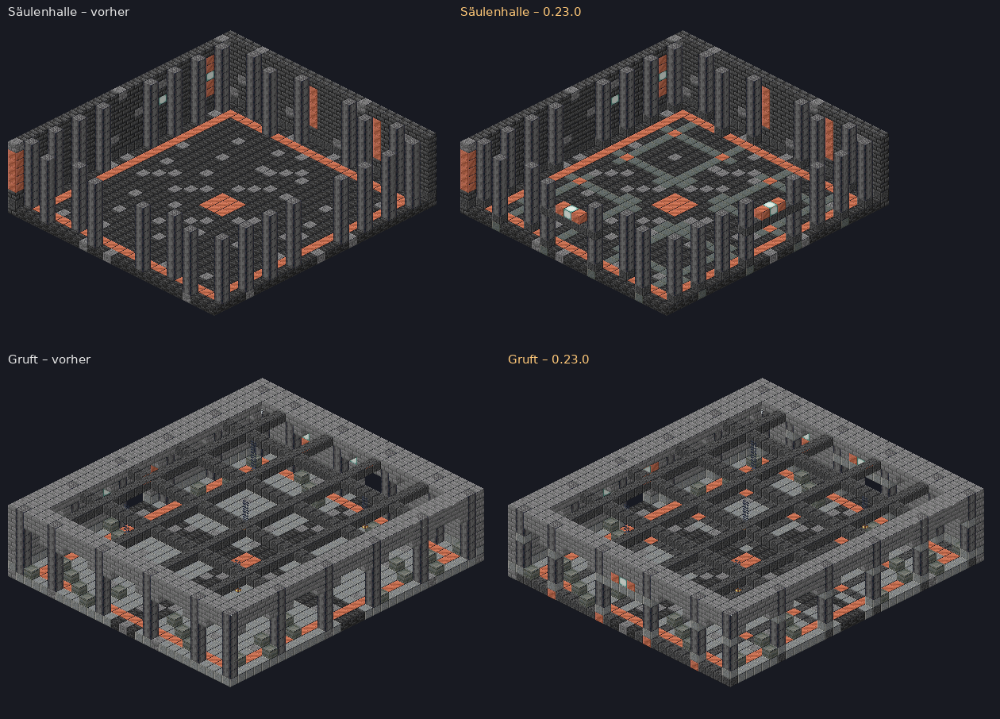

# Neu in Deepforge 0.23.0 – Bau-Modus für Admins und schönere Dungeons

Beim Serverstart steht im Log `Deepforge 0.23.0 ready`. **Das Ressourcenpaket bleibt gleich** (wie 0.20.0). Spielstände bleiben erhalten.

## 🧱 Bau-Modus für Admins (dein Wunsch)
Mit dem Bau-Modus kannst du selbst Sachen in der Welt und in den Dungeon-Räumen beheben und verbessern. Was du baust, bleibt dauerhaft erhalten, auch wenn Dorf, Wald, Minen oder Dungeons neu aufgebaut werden.

**Einschalten:** `/df admin bau` (Recht `deepforge.admin`). Du bist dann im Kreativmodus, Deepforge blockiert nichts mehr. Nochmal `/df admin bau` schaltet ihn aus. Danach hast du wieder deinen vorigen Spielmodus, und Kreativ-Gegenstände werden aus dem Inventar entfernt.

### Welt: Dorf, Wald, Minen
- Jeder Block, den du setzt, abbaust, mit Eimer füllst oder leerst, wird im Bauplan gespeichert. Auch Türen, Betten und hohe Pflanzen (beide Hälften) und Blöcke, die dabei mitfallen, werden erfasst.
- Die Änderungen gelten **für alle Spieler-Gelände**. Gespeichert wird relativ zum Gelände: Baust du im Dorf eine Bank, steht sie in jedem Dorf an derselben Stelle.
- Nach jedem Neuaufbau (Update, neues Gelände, Minen-Umbau) wird der Bauplan automatisch wieder eingesetzt.

### Dungeon-Räume
- `/df admin bau dungeon gewölbe` (oder `glutschmiede`, `frostkrypta`, optional mit Minennummer) öffnet eine **Dungeon-Werkstatt**: einen echten Dungeon ohne Gegner, Timer und Tore. Du landest in Raum 1, und der Chat listet alle Räume auf.
- `/df admin bau raum <nr>` bringt dich in einen anderen Raum.
- Was du in einem Raum baust, gilt ab dem nächsten Lauf **für alle Räume derselben Art** (Dungeon-Art, Raumform und Aufgabe, z. B. „Runengewölbe · Säulenhalle · Kampf“). Nebenräume haben eigene Arten.
- Räume sind verschieden groß. Deshalb merkt sich Deepforge, woran ein Block hängt:
  - Bis 3 Blöcke von einer Wand entfernt hängt er an dieser Wand. Ein Banner an der Ostwand bleibt in einem größeren Raum an der Ostwand.
  - Weiter innen hängt er an der Raummitte.
  - Nahe der Decke hängt er an der Decke.

  Passt ein Block in einen kleineren Raum nicht hinein, wird er dort weggelassen.
- `/df admin bau dungeon neu` baut einen anderen Grundriss, damit du siehst, wie deine Änderungen in anderen Raumgrößen wirken.
- `/df admin bau dungeon ende` schließt die Werkstatt. Sie schließt sich auch, wenn du den Bau-Modus ausschaltest oder offline gehst.

### Alle Befehle
| Befehl | Wofür |
|---|---|
| `/df admin bau` | Bau-Modus an/aus |
| `/df admin bau hilfe` | Befehlsliste im Chat |
| `/df admin bau info` | wie viele Blöcke gespeichert sind, und in welcher Raumart du stehst |
| `/df admin bau zurück [n]` | letzte (oder letzte n) Änderungen rückgängig, bis zu 2.000 |
| `/df admin bau pos1` · `pos2` | Ecken einer Auswahl (angeschauter Block oder deine Position) |
| `/df admin bau übernehmen` | alles in der Auswahl in den Bauplan übernehmen (bis 250.000 Blöcke), z. B. nach WorldEdit |
| `/df admin bau löschen hier [radius]` | Bauplan-Einträge um dich herum entfernen (Standard 5) |
| `/df admin bau löschen raum` | Bauplan der Raumart, in der du stehst, zurücksetzen |
| `/df admin bau anwenden` | Welt-Bauplan sofort neu auf dein Gelände setzen |
| `/df admin bau dungeon <art> [mine]` · `neu` · `ende` | Dungeon-Werkstatt |
| `/df admin bau raum <nr>` | in einen Werkstatt-Raum springen |

**Gut zu wissen:**
- Gespeichert wird in `plugins/Deepforge/bauplan.json`. Die Datei wird alle 10 Sekunden und beim Stoppen geschrieben. Sichere sie wie die Datenbank.
- Gespeichert werden Block und Ausrichtung, **nicht** Schildtexte, Truhen-Inhalte oder Banner-Muster.
- Bauen mit WorldEdit wird nicht automatisch erfasst. Danach die Stelle mit `pos1`/`pos2` markieren und `übernehmen`.
- In Dungeon-Räumen bitte die Tür-Gassen und die Mitte frei lassen. Dort laufen Gegner, Rätsel und Tore.
- Während eines eigenen Dungeon-Laufs und im Admin-Modus lässt sich der Bau-Modus nicht einschalten.

## ⚔ Dungeons: Übersicht, Animationen und Räume (dein Wunsch)

### Raum-Übersicht in der Seitenleiste
Im Dungeon zeigt die Seitenleiste statt Geld und Rucksack den ganzen Lauf:
```
⚔ RUNENGEWÖLBE
Normal · L4 · 61:45
✔ Halle der Runen
▶ Runenhalle · Welle 1/2
· Runenhalle · 1 Welle
· Runenkammer · Hebelrätsel
☠ Herz des Gewölbes · Endboss
★ Prüfungskammer · offen
➜ Besiegt alle Gegner (5)
```
- **Kopf:** Dungeon-Art, Schwierigkeit, Level und Restzeit. Die Zeit wird in den letzten 2 Minuten rot.
- **Räume:**
  - ✔ = geschafft
  - ▶ = aktueller Raum mit Welle oder Rätsel
  - · = kommt noch, mit Aufgabe
  - ☠ = Endboss
  - Bei mehr als 7 Räumen wandert die Liste mit.
- **Nebenräume (★):** geschafft, offen, Schlüssel fehlt, verpasst, oder ab welchem Raum sie öffnen.
- **Ziel (letzte Zeile):** z. B. „Besiegt alle Gegner (5)“ oder „Folgt der Spur zum nächsten Raum“.
- Im **Tiefengang** stehen dort Ebene, Mine, Level, Welle, Gegner und wie viele Ebenen es noch bis zum Boss sind.
- **Zuschauer** sehen die Übersicht auch.

### Animationen
- **Leuchtspur zum nächsten Raum:** Ist ein Raum geschafft, laufen Lichtpunkte über den Gangboden bis zum nächsten Tor. Niemand muss mehr den Ausgang suchen.
- **Tore:**
  - Das Fallgitter zieht sich Reihe für Reihe hoch, mit Kettengeräusch und Funken.
  - Schließen geht in einem Schlag, mit Knall und Staub.
- **Gegner erscheinen** aus einem Beschwörungskreis in der Farbe des Dungeons:
  - Runengewölbe: violett mit Seelenflammen
  - Glutschmiede: orange mit Feuer
  - Frostkrypta: eisblau mit Schneeflocken

  Elite und Bosse bekommen einen größeren Kreis.
- **Besiegte Gegner** zerfallen in Rauch, ihre Seele steigt auf. Elite-Gegner klingen hell nach.
- **Raum geschafft:** Feuerwerk unter der Decke, goldener Funkenregen und eine Fanfare.

### Raum-Architektur


- **Torbögen:**
  - Über jeder Tür liegt ein Sturz zwischen den Wandpfeilern.
  - Darüber hängt eine Lampe, flankiert von Zierblöcken. Türen sind so schon von Weitem zu sehen.
- **Bodenmuster:**
  - Ein Fliesenraster liegt in Linie mit den Pfeilern, mit Zierpunkten an den Kreuzungen.
  - Um das Mittelmedaillon liegt eine Raute.
  - Jede Dungeon-Art hat eigene Farben:
    - Runengewölbe: Tiefenschiefer, Tuff und Schwarzstein
    - Glutschmiede: Netherziegel
    - Frostkrypta: dunkler Tiefenschiefer auf Schnee und Kalzit
- **Säulen und Wandpfeiler** haben jetzt Sockel und Kapitell und wirken wie richtige Säulen.
- Gekämpft wird wie bisher: Nur die Bodenschicht und Blöcke über Kopfhöhe haben sich geändert.

## Getestet
- **354 Unit-Tests** grün, darunter 3 neue für die Raum-Verankerung:
  - Ein Block an der Wand bleibt in einem größeren Raum an der Wand.
  - Ein Block, der nicht in den Raum passt, wird weggelassen.
  - Speichern und Laden liefern dieselbe Position.

  Die Dungeon-Tests prüfen weiter, dass alle Türen und Gänge begehbar sind.
- **Live auf dem Testserver mit Bot:**
  - **Bau-Modus:**
    - Ein Goldblock im Dorf wird gespeichert.
    - `zurück` entfernt ihn wieder.
    - Nach dem Löschen über die Konsole setzt `anwenden` ihn neu.
    - In der Werkstatt steht ein Smaragd an derselben Stelle, auch im neuen Grundriss mit anderer Raumgröße.
  - **Dungeon:**
    - Die Seitenleiste zeigt beim Start und nach jedem Raum den richtigen Stand.
    - Nach dem Verlassen ist die normale Seitenleiste wieder da.
  - Keine Fehler im Server-Log.
