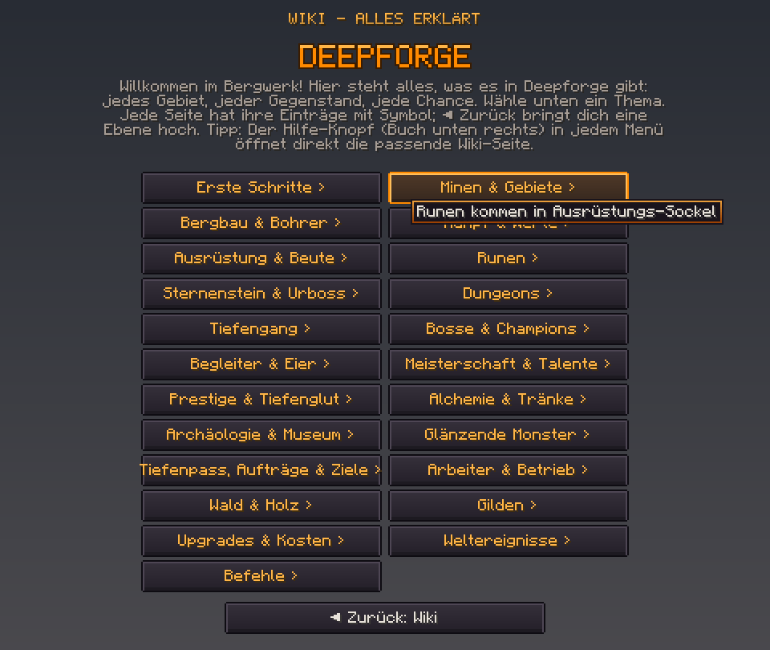
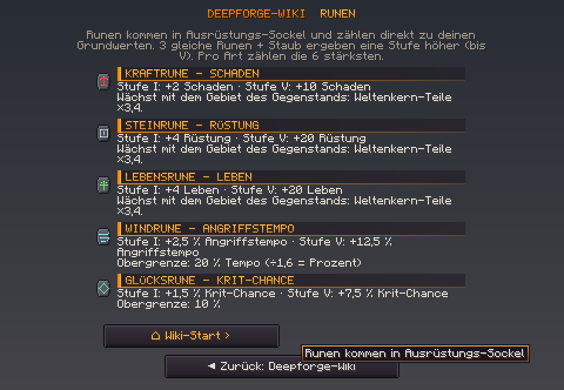

# Neu in Deepforge 0.15.1 – Wiki-Fenster im Deepforge-Stil

Beim Serverstart steht im Log `Deepforge 0.15.1 ready`.

Zum Ressourcenpaket:
- Es gibt ein **neues Ressourcenpaket**.
- Die SHA-1 steht in `resourcepack/pack.sha1` und ist in `config.yml` schon eingetragen.

## 🎨 Das Wiki sieht jetzt nach Deepforge aus
Vorher hatte das Wiki graue Minecraft-Knöpfe, gelbe Schrift und lila Tooltips. Jetzt passt es zum Rest des Servers: dunkler Schiefer mit Glut-Orange wie Scoreboard, HUD und Tab-Liste.

Vorschau aus den echten Paket-Texturen und der Minecraft-Schrift (GUI-Größe 2):

| Teil | Neu |
|---|---|
| **Knöpfe** | dunkler Schiefer mit feiner Kante; **beim Überfahren leuchtet die Kante orange** |
| **Knopftext** | helles Glut-Orange mit „›“ als Pfeil; Zurück und Schließen in Hellgrau |
| **Titel** | in der Deepforge-Pixelschrift (wie das HUD): „DEEPFORGE-WIKI  RUNEN“ |
| **Startseite** | großes **DEEPFORGE**-Logo im Netzwerk-Stil |
| **Einträge** | jede Überschrift steht auf einem **dunklen Balken mit oranger Kante** und Pixelschrift, daneben das Icon, darunter der Text in hellem Grau |
| **Tooltips** | dunkler Hintergrund mit **oranger Glutkante** statt Lila |
| **Scrollleiste** | orange statt grau (bei langen Seiten) |

- Die Pixelschrift hat jetzt auch **Ä, Ö, Ü**, damit „GLÄNZENDE MONSTER“ oder „ARCHÄOLOGIE“ richtig aussehen.
- **Ohne Ressourcenpaket** zeigt das Wiki weiter die einfache Textversion. Es ist also nie unlesbar.

### Gut zu wissen
Minecraft hat für Knöpfe und Tooltips nur **eine** Textur. Solange das Deepforge-Paket aktiv ist, haben deshalb **alle** Knöpfe und Tooltips diesen Look, also auch Pausenmenü und Einstellungen. Viele Netzwerk-Server machen das genauso (dein Bild 2 auch). Wer das Paket ablehnt, sieht weiter die normalen Minecraft-Knöpfe.

## Getestet
- **311 Unit-Tests** grün, neu: die Pixelschrift-Überschriften mit Umlauten, Wiki-Balken und Titel.
- **Ressourcenpaket geprüft:** 415 Texturen, ZIP intakt. Die Knöpfe, Tooltips und die Scrollleiste nutzen exakt die Maße und die Nine-Slice-Aufteilung der Minecraft-1.21.8-Originale (aus dem Client ausgelesen).
- **Live:** Der Server schickt die Wiki-Fenster Start, Runen, Wächter, Prestige und Museum fehlerfrei an den Client, ohne Fehler im Server-Log.
- **Grenze des Tests:** Der Test-Bot kann keine Fenster anzeigen und hatte kein Ressourcenpaket geladen. Live verschickt wurde deshalb die einfache Textversion; die gestylte Version habe ich nicht im Spiel gesehen. Die beiden Vorschaubilder oben habe ich aus den Paket-Texturen und der originalen Minecraft-Schrift nachgebaut. **Bitte einmal im Spiel mit dem neuen Paket ansehen** und sagen, was noch anders soll (Farben, Abstände …).
