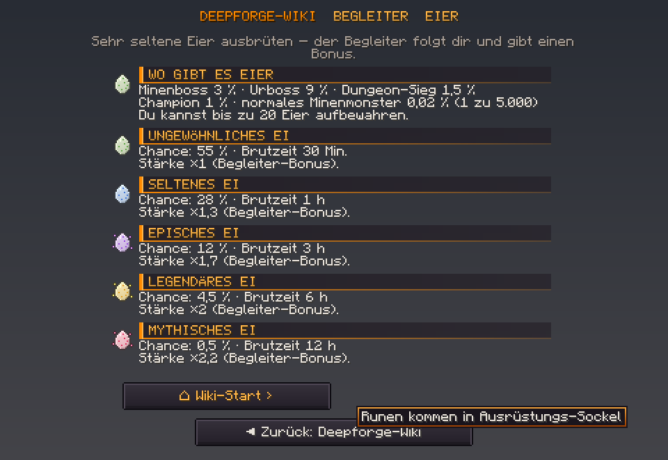

# Neu in Deepforge 0.15.2 – Wiki-Fenster repariert

Beim Serverstart steht im Log `Deepforge 0.15.2 ready`.

**Neues Ressourcenpaket.** Die SHA-1 steht in `resourcepack/pack.sha1` und ist in `config.yml` schon eingetragen.

## 🐞 Was im Wiki kaputt war (Screenshot „Begleiter & Eier“)

| Fehler | Ursache | Jetzt |
|---|---|---|
| **Alle Textzeilen waren Kästchen** | Die Zeilen haben die Pixelschrift der Überschrift „geerbt“. Die hat nur Großbuchstaben und Zahlen, darum erschien alles andere als Kästchen. | Überschrift und Text sind jetzt getrennt: Überschrift in der Pixelschrift, Text in der normalen Minecraft-Schrift. |
| **Kleines Kästchen vor jeder Überschrift** | Der orange Balken war 296 Pixel breit. Minecraft speichert Schrift-Zeichen auf 256 Pixel breiten Seiten und zeigt größere als Fehlerzeichen. | Der Balken besteht jetzt aus zwei Hälften zu je 148 Pixeln. |
| **Alles mittig und krumm** | Dialog-Texte zentriert Minecraft Zeile für Zeile. | Das Wiki bricht die Zeilen selbst um, mit den **echten Zeichenbreiten der Minecraft-Schrift**, und füllt jede Zeile unsichtbar auf dieselbe Breite auf. So steht der Text **linksbündig** unter der Überschrift. |
| „normales Minenmonster **0 %** (1 zu 5.000)“ | Kleine Chancen wurden auf 0 gerundet. | Jetzt „**0,02 %**“. Das Wiki ist nach weiteren „0 %“ durchsucht, es gibt keine mehr. |

- Das Warnsymbol oben rechts im Fenster (kommt von Minecraft bei jedem Server-Dialog) ist jetzt auch im Deepforge-Look: dunkel mit orangem „!“.
- **Damit das nicht wieder passiert:** Die Paket-Prüfung schlägt jetzt Alarm, wenn ein Schrift-Zeichen größer als 256 Pixel ist.

Vorschau aus den echten Paket-Texturen und der Minecraft-Schrift:

## Getestet
- **314 Unit-Tests** grün. Neu:
  - Zeichenbreiten stimmen mit der Minecraft-Schrift überein.
  - Keine Wiki-Zeile ist breiter als das Fenster.
  - Jede Zeile ist exakt gleich breit aufgefüllt.
  - Die Überschrift hat die richtige Breite.
- **Live mit Ressourcenpaket:**
  - Der Test-Bot hat das Paket angenommen, der Server hat die gestylte Fassung geschickt: Pixelschrift und beide Balken-Hälften kommen an.
  - Wiki-Start, Begleiter und Runen gehen fehlerfrei raus.
  - Keine Fehler im Server-Log.
- **Nicht gesehen:** Wie es auf dem Bildschirm aussieht, kann der Bot nicht zeigen. **Bitte einmal im Spiel ansehen**, am besten dieselbe Seite wie auf dem Screenshot.
